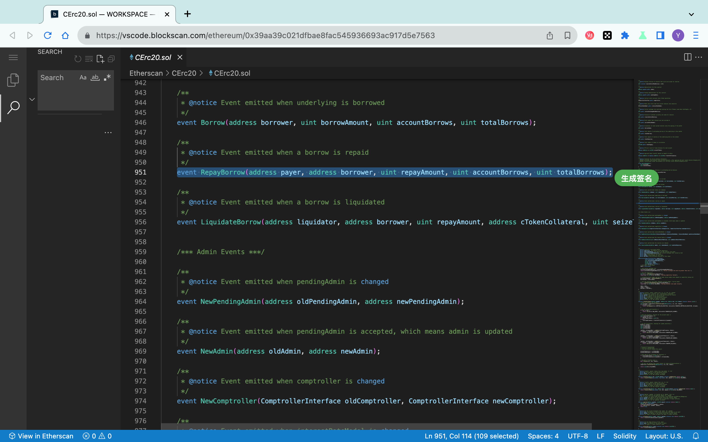
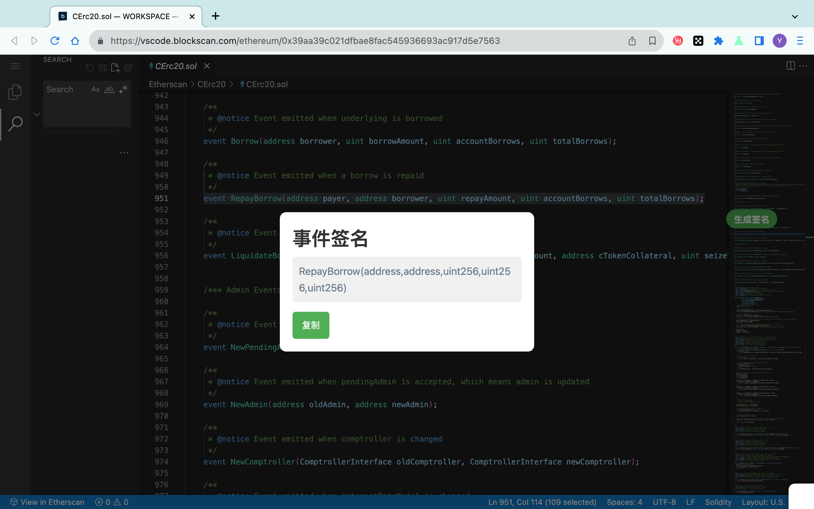

# 合约事件签名生成工具

# 动机
对于一个以太坊合约，对事件签名进行`keccak256`运算即可得到`Log`的`topic[0]`，想要通过`topic[0]`得知是什么事件，就需要提前准备事件签名，做好映射。

由于现在有浏览器端的代码阅读工具，所以制作此工具用于简化收集事件签名的步骤。

# 使用方法：
1. 鼠标直接选中页面中的事件定义部分，例如：`event Approval(address indexed owner, address indexed spender, uint256 value)`
2. 光标箭头旁会出现"生成签名"按钮，点击按钮自动弹窗显示生成后的签名。
3. 点击复制，弹窗自动消失

# 示例

# 安装方法：
+ 克隆仓库
+ 打开Chrome浏览器扩展程序的开发者模式，点击左上角“加载已解压的扩展程序”
